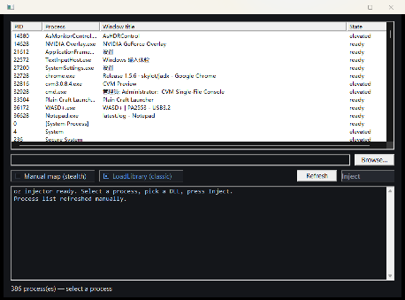

# oz injector

> English | [简体中文](README.md)

A standalone x64 DLL injector, extracted from OpenZen's `native/loader` and
generalised: any DLL, any process, two injection modes, dark UI.



The OpenZen original carries one hardcoded payload (its own `OpenZen.dll`)
inside an RCDATA blob and targets `javaw.exe`. This build takes the DLL path and
the target from the UI, so it works as a general-purpose tool.

## What this is

A **developer / debugging tool**. It does the same thing as any process-injection
utility you can find in the Windows toolchain: load a DLL into a running x64
process of your choosing, either through the loader or by mapping the image
yourself.

Use it for what injection is normally used for — attaching a debugger, running
instrumented or diagnostic code inside a live process, hooking to observe
behaviour. You supply the DLL; this tool only performs the load.

If you do not own the target process, do not have permission to modify it, or
are not authorised to do so, this is not the tool for you. The target's owner can
usually see the load in a module listing, a handle monitor, or EDR, and manual
mapping only removes it from one of those views, not from all of them.

## Build

```
build_msvc.bat            # Release, -> build\Release\oz_injector.exe
build_msvc.bat Debug
```

Or with CMake, where the generator can find the compiler:

```
cmake -S . -B build -A x64
cmake --build build --config Release
```

`build_msvc.bat` calls the toolchain directly because this workspace's sandbox
blocks `reg.exe`, which `vcvars64.bat` needs — CMake's compiler detection fails
there. The batch script sets `INCLUDE`/`LIB`/`PATH` itself. It also builds and
runs a UI self test, and fails the build if it does not pass.

Requirements: MSVC (VS 2022, 14.44 tested) and the Windows SDK. **No Qt, no
vcpkg, no third-party libraries** — the UI is plain Win32 + GDI, so this builds
in seconds rather than the ~2h a static Qt build needs.

Output: `build\Release\oz_injector.exe`, ~240 KB, single file, no runtime deps.

## Use

**GUI** — run it:

1. Pick a process from the list (auto-refreshes every second; shows the window
   title so you can tell instances apart).
2. Pick a mode: `Manual map` or `LoadLibrary`. **The default is `LoadLibrary`** —
   it works with any DLL, needs no relocation table, and does not skip TLS
   callbacks. Switch to `Manual map` only when the module list really has to come
   up empty.
3. **Browse** to a DLL.
4. Press **Inject**. The log pane shows each step and the final result.

**One-shot** — for scripts:

```
oz_injector.exe --inject <pid> <dll.dll> [--manual|--loadlibrary]
```

Prints the step trace to stderr; exit code 0 on success, 1 on failure.
`oz_injector.exe /?` prints usage.

## The two modes

| | Manual map | LoadLibrary |
|---|---|---|
| In the module list? | No | Yes |
| Mechanism | relocates the PE in target memory, fixes imports, calls `DllMain` through a trampoline | remote `LoadLibraryW` |
| DLL must be relocatable | Yes | No |
| Harder to debug | Yes | No |

Manual map keeps the DLL invisible to anything that inspects the target's module
list. LoadLibrary is the classic approach — simpler, and it works with DLLs that
were not built to be relocated.

Both need the target to run at or below the injector's integrity level. Run the
injector elevated if the target is elevated.

**A manually mapped image cannot be unloaded.** There is no `FreeLibrary` path
for an image the loader never registered, so it stays resident for the life of
the target process. The injector tracks one injected pid per session and refuses
to inject twice into it.

## Layout
```
src/oz_injector_core.h    the engine API (no UI, no Qt)
src/oz_injector_core.cpp  engine: enumerate, validate, manual map, LoadLibrary
src/oz_injector_ui.h/.cpp window: process list, path field, modes, log
src/main.cpp              entry: GUI, and the --inject one-shot path
src/selftest.cpp          in-process UI verification, run by the build
src/render.cpp            dumps the UI to a PNG from inside the process
res/                      icon, manifest (comctl32 v6, per-monitor DPI), rc
test/                     end-to-end injection test
```

The engine knows nothing about windows or messages, so it can be reused from a
console tool or a different UI.

## Tests

**UI** — `build_msvc.bat` runs `selftest.exe` after linking. It creates the real
window and asserts every child control came up, that the process list is
populated, that the log has content, that pressing Refresh appends a clean,
readable line, that every button has a caption, that **clicking a mode option
actually changes the injection mode**, and that **the scrolled-to row is still
visible after the list is rebuilt**. Twenty-three checks; all pass.

Both of those have to assert on the real effect rather than the control's
surface state:

- **Mode options.** The two controls are `BS_OWNERDRAW`, and that style
  consumes the button-type bits, so they are not radio buttons at all:
  `CheckRadioButton` is a no-op, `IsDlgButtonChecked` always answers 0, and
  `BM_CLICK` does not change anything. The assertion therefore reads
  `AppWindow::current_mode()` — the value actually handed to the engine.
- **Scroll.** The assertion is that the anchored row is still *visible*, not
  that the row index is unchanged. Every enumeration re-sorts the list
  (windowed processes first, then by PID), so indices legitimately move. The
  test also forces the rebuild with `refresh_processes(force=true)`, because
  otherwise the change detection returns early on an idle machine and the test
  would be asserting against code that never ran.

**Injection** —

```
cd test
build_test.bat
python e2e_test.py
```

It starts a probe host, injects a probe DLL with each mode, and asserts two
things per mode: that `DllMain` actually ran (the DLL records its own image base
to a marker file), and that the module appears in — or is absent from — the
target's module list.

Last run: **2/2 passed.**

| mode | DllMain base | in module list | expected |
|---|---|---|---|
| `--manual` | `0x24921AA0000` | no | not listed |
| `--loadlibrary` | `0x7FFBE93C0000` | yes | listed |

The two recorded bases also demonstrate why the engine does not trust
`GetExitCodeThread` for a 64-bit `HMODULE`: the injector observed `0xAC0B0000`
while the DLL itself saw `0x7FFBAC0B0000`.

## Notes and limits

- x64 only. A 32-bit target or DLL is rejected with `WrongArchitecture`.
- Manual mapping requires `IMAGE_DIRECTORY_ENTRY_BASERELOC`; a DLL built
  `/DYNAMICBASE:NO` is rejected with `RelocationUnsupported`.
- TLS callbacks and static initialisers that depend on the loader having
  registered the module may behave differently under manual mapping.
- Import resolution walks the target's module list, then falls back to a remote
  `LoadLibraryW` for anything missing.
- **The log pane is a plain `EDIT`, not a RichEdit or an owner-draw listbox.**
  Both earlier attempts were wrong on this machine:
  - RichEdit ignores `EM_SETBKGNDCOLOR` and `WM_CTLCOLOREDIT` for its background,
    so the pane stayed white and could not be themed.
  - An `LBS_OWNERDRAWFIXED` listbox does not support `LB_SETITEMDATA` (leaving
    `DRAWITEMSTRUCT.itemData` undefined), and `LB_ADDSTRING` always takes an
    **ANSI** string. On a CJK code page (this machine is ACP 936) that mangled
    every non-ASCII character into mojibake — the `──` separators rendered as
    garbage. `EM_REPLACESEL` takes a wide string, so an `EDIT` sidesteps all of
    it.
- `render_ui.bat` captures the UI from inside the owning process. An external
  window enumerator cannot see this sandbox's GUI session, so the pixels have to
  be read by the process that owns the window.

## Publishing / pushing

`publish.bat` creates the GitHub repository if needed and pushes `main`:

```
publish.bat            # prompts for the token
publish.bat <token>   # non-interactive
```

It needs `git` on PATH plus a token with write access (a classic PAT with `repo`
scope, or a fine-grained PAT with Contents: read+write). The token is passed in
the remote URL rather than stored in `.git/config`, so it does not persist on
disk.

Note: the repository had to be created by a human. The GitHub connector
available while this was written is a GitHub App without the Administration
permission, so `POST /user/repos` returns
`403 Resource not accessible by integration` — `publish.bat` handles both cases
(creates the repo when the token can, then pushes either way).
